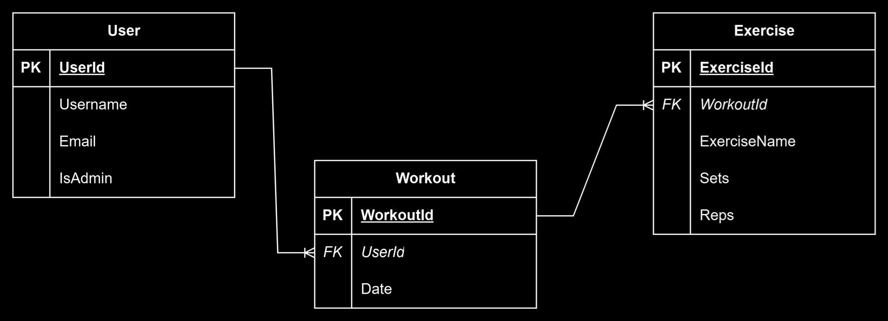

# CST438 P2 Backend - Group 12

## Description

The backend of our project implements a REST API using Spring Boot, OAuth2, and Docker.
Our API allows users to track their activity and progress at the gym.

## Team Members

- Daniel Everman
- Augustin Morales
- Alejandro Hernandez-Garibay

## Tech Stack (Backend)

- Spring Boot
- Docker
- OAuth2
- Render

## How To Run

The provided Dockerfile should allow the project to build successfully on your machine.
Use `docker build --secret id=secret,src=./.env .` in your Terminal to build the project and containerize it with Docker.

*NOTE - You will have to generate your own Google OAuth credentials and store them in a .env file, or store them in some other alternative way that the project can access.*

## Live API URL

https://p2-backend-7wbr.onrender.com/

*NOTE - May take a few minutes to spool up again as Render automatically shuts down instances on its free tier. Please authenticate using your CSUMB email.*

## Swagger Docs

Available at `/swagger-ui.html` after starting the app

## Postman Collection

[Available here](./postman)

## Entity Relationship Diagram

